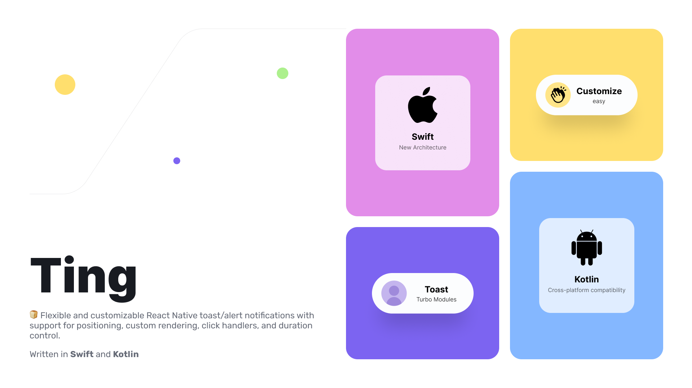

![Logo][Logo]
[![BuyMeACoffee][BuyMeACoffee]][BuyMeACoffee-URL] [![Kofi][Kofi]][Kofi-URL]

<p align="center">
  
</p>

## Overview

 [![Swift][Swift]][Swift-URL] [![Kotlin][Kotlin]][Kotlin-URL]

<a href="https://www.producthunt.com/posts/ting-4?utm_source=badge-featured&utm_medium=badge&utm_souce=badge-ting&#0045;4" target="_blank"></a>

🍞 Flexible and customizable React toast notifications with support for positioning, custom rendering, click handlers, and duration control.

## Video Demo 📺

| ![ios]                                                                                               | ![android]                                                                                           | Modal                                                                                                |
| ---------------------------------------------------------------------------------------------------- | ---------------------------------------------------------------------------------------------------- | ---------------------------------------------------------------------------------------------------- |
| <video src="https://github.com/baronha/ting/assets/23580920/15f5677a-d041-499b-99e8-75c9c9c511c9" /> | <video src="https://github.com/baronha/ting/assets/23580920/751a7559-0150-46a2-a573-b2b3423e6e29" /> | <video src="https://github.com/baronha/ting/assets/23580920/b5f4d555-8fb1-4ffe-901c-268099f16f03" /> |

## Installation

```sh
yarn add @baronha/ting
or
npm i @baronha/ting
```

> If you want to use Expo. [Burnt](https://github.com/nandorojo/burnt) is the solution for you.

### [![iOS][iOS]][iOS-URL]

#### New Architecture

```sh
cd ios && RCT_NEW_ARCH_ENABLED=1 bundle exec pod install --verbose
```

#### Older

```sh
cd ios && pod install --verbose
```

## Usage

### ![Toast][Toast]

```js
import { toast } from '@baronha/ting';
// ...
const options = {
  title: 'Done 😎',
  message: 'Successful!!',
};

toast(options); // easy to use
```

#### Customize Icon

```js
import { toast } from '@baronha/ting';
// ...
const options = {
  // ...
  title: 'Vietnamese Gangz 😎',
  message: 'Anh em tao là Vietnamese Gangz',
  titleColor: '#D60A2E',
  icon: {
    uri: require('./vietnam.png'), // or remote
    size: 24,
  },
};

toast(options); // icon is 🇻🇳
```

### ![Alert][Alert]

```js
import { alert } from '@baronha/ting';
// ...
const options = {
  title: 'Done 😎',
  message: 'Successful!!',
};

alert(options); // easy to use
```

### Initialization

Instead of using too many options like this:

```js
const options = {
  // ...
  messageColor: '#D60A2E',
  titleColor: '#D60A2E',
  icon: {
    uri: require('./vietnam.png'), // or remote
    size: 24,
  },
  shouldDismissByTap: true,
  position: 'bottom',
  // ... bla bla bla
};

toast(options);
```

You want to initialize the default options for all subsequent use of toast or alert. You can use the setup function that is called when the application is initialized. Do the following:

```js
import { setup } from '@baronha/ting';

const initOption = {
  toast: {
    messageColor: '#D60A2E',
    titleColor: '#D60A2E',
    backgroundColor: '#ffffff',
    // ... more and more
  },
  alert: {
    // ... alert's option
  },
};

setup(initOption);

// Use it next time. You can completely override it on subsequent calls
toast({
  title: 'Ting!',
  message: 'Easy toast for React Native',
});

alert({
  title: "What's up bruhhh!",
  message: 'Easy Alert for React Native',
});
```

## Options

| Property              |   Type   | Default value |  Platform  | Toast | Alert | Description                                                                                 |
| --------------------- | :------: | :-----------: | :--------: | :---: | :---: | :------------------------------------------------------------------------------------------ |
| `title`               |  string  |     null      |  ![Both]   |  ✅   |  ✅   |                                                                                             |
| `message`             |  string  |     null      |  ![Both]   |  ✅   |  ✅   |                                                                                             |
| `titleColor`          |  string  |     null      |  ![Both]   |  ✅   |  ✅   | The color of the title text in hexadecimal format (e.g., #FF0000)                           |
| `messageColor`        |  string  |     null      |  ![Both]   |  ✅   |  ✅   | The color of the message text in hexadecimal format (e.g., #00FF00)                         |
| `icon`                | `object` |     null      |  ![Both]   |  ✅   |  ✅   | See [Icon](###Icon)                                                                         |
| `preset`              |  string  |    `done`     |  ![Both]   |  ✅   |  ✅   | `done, error, none, spinner`                 |
| `duration`            |  number  |      `3`      |  ![Both]   |  ✅   |  ✅   | The lifetime of the toast (seconds)                                                         |
| `titleColor`          |  string  |     null      |  ![Both]   |  ✅   |  ✅   |                                                                                             |
| `shouldDismissByDrag` | boolean  |     true      |  ![Both]   |  ✅   |
| `position`            |  string  |     `top`     |  ![Both]   |  ✅   |       | **Toast** is displayed from `top` or `bottom`                                               |
| `haptic`              |  string  |     null      |   ![iOS]   |  ✅   |       | `success, warning, error, none`                                                             |
| `shouldDismissByTap`  | boolean  |     true      |  ![Both]   |       |  ✅   |                                                                                             |
| `borderRadius`        |  number  |     null      |  ![Both]   |       |  ✅   |                                                                                             |
| `blurBackdrop`        |  number  |     null      | ![Android] |       |  ✅   |                                                                                             |
| `backdropOpacity`     |  number  |     null      | ![Android] |       |  ✅   |                                                                                             |
| `backgroundColor`     |  string  |    #ffffff    |  ![Both]   |  ✅   |  ✅   | The background color of the toast in hexadecimal format (e.g., #0000FF) <br/> |

### Icon

| icon        |  Type  | Default value | Platform |
| ----------- | :----: | :-----------: | :------: |
| `uri`       | string |     null      | ![Both]  |
| `size`      | number |     null      | ![Both]  |
| `tintColor` | string |     null      | ![Both]  |

## To Do

- [x] Initialize for the first time (v.1.0.5)
- [x] `tintColor` for icon (v.1.0.5)
- [x] `backgroundColor` (v.1.0.3)
- [x] `spinner preset for toast` (v.1.1.0)
- [x] custom color like StyleSheet (e.g. `#fff`, `red`, `rgba(0, 0, 0, .8)`)
- [x] `shouldDismissByDrag` on **Android**
- [ ] `callback`


## Performance

We're trying to improve performance. If you have a better solution, please open a [issue](https://github.com/baronha/ting/issues) or [pull request](https://github.com/baronha/ting/pulls). Best regards!

## Contributing

See the [contributing guide](CONTRIBUTING.md) to learn how to contribute to the repository and the development workflow.

## Contributors ✨

Thanks go to these wonderful people:

<!-- readme: collaborators,contributors -start -->
<table>
	<tbody>
		<tr>
            <td align="center">
                <a href="https://github.com/4cc3ssX">
                    
                    <br />
                    <sub><b>Ryam</b></sub>
                </a>
            </td>
            <td align="center">
                <a href="https://github.com/baronha">
                    
                    <br />
                    <sub><b>Bảo Hà.</b></sub>
                </a>
            </td>
            <td align="center">
                <a href="https://github.com/Acetyld">
                    
                    <br />
                    <sub><b>Dion Grendelman</b></sub>
                </a>
            </td>
            <td align="center">
                <a href="https://github.com/jeongshin">
                    
                    <br />
                    <sub><b>Huckleberry</b></sub>
                </a>
            </td>
            <td align="center">
                <a href="https://github.com/tuanngocptn">
                    
                    <br />
                    <sub><b>Nick - Ngoc Pham</b></sub>
                </a>
            </td>
		</tr>
	<tbody>
</table>
<!-- readme: collaborators,contributors -end -->

## License

MIT
[AlertKit](https://github.com/sparrowcode/AlertKit/blob/v5/LICENSE)
[SPIndicator](https://github.com/ivanvorobei/SPIndicator/blob/main/LICENSE)
[EasyWindow](https://github.com/getActivity/EasyWindow/blob/master/LICENSE)

<!-- Badge for README -->

[iOS]: https://img.shields.io/badge/iOS-000000?style=for-the-badge&logo=ios&logoColor=white
[iOS-URL]: https://www.apple.com/ios
[Android]: https://img.shields.io/badge/Android-3DDC84?style=for-the-badge&logo=android&logoColor=white
[Android-URL]: https://www.android.com/
[React-Native]: https://img.shields.io/badge/React_Native-20232A?style=for-the-badge&logo=react&logoColor=61DAFB
[React-Native-URL]: https://reactnative.dev/
[React-Native]: https://img.shields.io/badge/React_Native-20232A?style=for-the-badge&logo=react&logoColor=61DAFB
[React-Native-URL]: https://reactnative.dev/
[Swift]: https://img.shields.io/badge/Swift-FA7343?style=for-the-badge&logo=swift&logoColor=white
[Swift-URL]: https://developer.apple.com/swift/
[Kotlin]: https://img.shields.io/badge/Kotlin-0095D5?&style=for-the-badge&logo=kotlin&logoColor=white
[Kotlin-URL]: https://kotlinlang.org/
[Logo]: https://img.shields.io/badge/🍞_Ting-FDC753?style=for-the-badge
[Toast]: https://img.shields.io/badge/🍞_Toast-A0E7B0?style=for-the-badge
[Alert]: https://img.shields.io/badge/🌭_Alert-7C64F1?style=for-the-badge
[Both]: https://img.shields.io/badge/Both-61DAFB?style=for-the-badge
[BuyMeACoffee]: https://img.shields.io/badge/Buy_Me_A_Coffee-FFDD00?style=for-the-badge&logo=buy-me-a-coffee&logoColor=black
[BuyMeACoffee-URL]: https://buymeacoffee.com/baronha
[Kofi]: https://img.shields.io/badge/Ko--fi-F16061?style=for-the-badge&logo=ko-fi&logoColor=white
[Kofi-URL]: https://ko-fi.com/baoha
[New_Feature]: https://img.shields.io/badge/✨_New_Feature-D40A2E?style=for-the-badge
